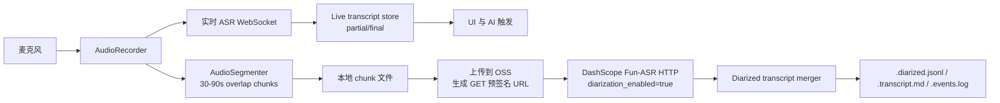

# 说话人分离与分片录音转写调研

日期：2026-05-23

## 结论

说话人分离不应塞进当前 `qwen3-asr-flash-realtime` 实时链路。官方模型表显示，Qwen-ASR 实时与文件转写均不支持说话人分离；Fun-ASR 的非实时 HTTP 文件识别支持说话人分离。因此下一阶段应采用双轨策略：

1. **实时轨**：保留当前 `qwen3-asr-flash-realtime` WebSocket，用于会议中低延迟 partial、AI 触发和 UI 展示。
2. **分片归档轨**：新增录音分片器，每隔固定时间封存一段本地音频，上传到可访问 URL 后调用 DashScope Fun-ASR 非实时 HTTP 转写，开启 `diarization_enabled`，再把带 `speaker_id` 的句子结果合并回会话时间线。

2026-05-23 实施更新：用户已选择“最快个人原型”路线，存储边界采用私有 OSS bucket + 官方 OSS Swift SDK + GET 预签名 URL。当前代码已经实现 chunk 封存、OSS 上传适配器、Fun-ASR submit/poll/result parser、后台 pipeline、`.diarized.jsonl` / `.transcript.md` 回填和 UI 说话人分离回填显示。真实云端验证仍需要配置 `MEETINGAI_DIARIZATION_UPLOAD_BUCKET` 和 OSS 凭证。

## 官方能力核对

- DashScope 将实时识别定义为 WebSocket 音频流输入、文本流式输出；非实时识别是提交音频文件后获取识别结果。官方推荐非实时场景用 `fun-asr` 做热词和说话人分离。
- 模型能力表中，`fun-asr` 是非实时 HTTP 模型，支持说话人分离；`fun-asr-realtime` 不支持说话人分离。
- Qwen-ASR 系列里，`qwen3-asr-flash-realtime`、`qwen3-asr-flash-filetrans`、`qwen3-asr-flash` 均标为不支持说话人分离。
- Fun-ASR 录音文件识别 REST API 支持 `diarization_enabled` 和 `speaker_count` 参数；开启后识别结果的句子或词条会带 `speaker_id`。
- Fun-ASR 文档说明说话人分离仅适用于单声道音频；启用后建议音频时长不超过 2 小时。
- Fun-ASR REST 提交任务需要 `Authorization: Bearer ...`、`Content-Type: application/json` 和 `X-DashScope-Async: enable`；异步任务查询使用 `GET /api/v1/tasks/{task_id}`。
- 官方异步任务管理文档标注单任务查询限流为 20 QPS，因此 App 默认轮询间隔使用 5 秒，避免高频查询。
- OSS Swift SDK v2 支持 Swift 5.9 / macOS，并提供 `putObject` 和 `presign`；第一版不手写 OSS V4 签名。

## 当前代码事实

- 当前实时 ASR 并不是只在停止录音时产出结果。`asr-bridge/stream.go` 会把 DashScope 中间结果转成 `partial`，把句末结果转成 `final`。
- `MeetingViewModel.handleTranscript` 已经把 partial 写入 UI 内存时间线和 `.events.log` 的 `transcript_partial`，AI 触发也已经改为基于 partial + final 的文本长度。
- `.txt` 仍只追加 final 转写。真实 smoke 中多次出现 `finalEntries=0`，因此 `.txt` 可能为空；`.transcript.md` 会在停止会议时保存 partial 快照，是当前会后兜底。
- 当前真实录音写 MP3 在本机失败过，已改为 MP3 失败时 fallback 到同前缀 `.wav`。分片上传应优先使用稳定的 WAV/PCM，而不是依赖 MP3 编码可用。

## 推荐架构

## 分片策略

建议初始参数：

- 分片长度：60 秒。
- 重叠：3-5 秒，用于减少边界断句丢失。
- 提交节奏：每个 chunk 封存后异步上传和提交，不阻塞实时 ASR。
- 时间轴：每个 chunk 记录 `chunkIndex`、`startTimeMs`、`endTimeMs`、`localPath`、`uploadURL`、`taskId`、`status`。
- 合并：把服务端返回的 sentence `begin_time` / `end_time` 加上 chunk 起点偏移，再按时间排序。
- 去重：重叠区按文本相似度和时间重叠去重，优先保留后一个 chunk 中更完整的句子。
- 失败处理：chunk 失败只标记该片 `failed`，不影响实时 ASR；后台可重试。

## 会话产物建议

新增或扩展以下文件：

- `{session}.chunks.jsonl`：每个录音分片的生命周期、上传 URL 摘要、DashScope task id、状态、错误。
- `{session}.diarized.jsonl`：合并后的说话人句子事件，字段含 `speakerId`、`beginMs`、`endMs`、`text`、`chunkIndex`、`confidence?`。
- `{session}.transcript.md`：从当前 partial/final 快照升级为“实时转写 + 已回填说话人分离结果”的可读版本。
- `{session}.events.log`：新增 `segment_created`、`segment_upload_started`、`segment_upload_completed`、`diarization_task_submitted`、`diarization_task_completed`、`diarization_merge_completed` 等事件。

## 实施顺序

1. 先抽象 `TranscriptStore`，让 UI partial/final、文件写入、后续 diarized 结果都落到同一个会话状态，不再由 `.txt` 单独代表完整转写。
2. 增加 `AudioSegmenter`，只负责从录音流稳定写 chunk 文件，先不上传。
3. 增加本地 fake diarization fixture，跑通 chunk lifecycle 和 merge 测试。
4. 接入真实上传层。需要决策 OSS、预签名 URL 或本机临时对象存储；DashScope 文件转写需要可访问的 `file_urls`。
5. 接入 Fun-ASR HTTP 异步任务，开启 `diarization_enabled`，按任务状态轮询并回填。
6. 最后再做 20-30 分钟真实彩排，重点看 chunk 边界、说话人稳定性、上传失败恢复和会后文件完整度。

## 待决策

- OSS bucket 名称、region、object prefix 和是否使用 STS token。
- 是否允许真实会议音频上传云端长期存储；当前按用户决策保留全部 chunk，不自动删除。
- 说话人数量是否让用户设置 `speaker_count`，还是默认自动识别；当前只在配置 2-100 时传入，否则让 Fun-ASR 自动判断。
- 跨 chunk 的 `speaker_id` 官方未承诺稳定指向同一真人；当前只做本地合并和展示，不把 speaker-0 解释为跨全会固定身份。

## 参考来源

- DashScope 语音识别模型选型与能力表：https://help.aliyun.com/zh/model-studio/asr-model/
- DashScope Qwen-ASR 实时 WebSocket 交互流程：https://help.aliyun.com/zh/model-studio/qwen-asr-realtime-interaction-process
- DashScope Fun-ASR 录音文件识别 REST API：https://help.aliyun.com/zh/model-studio/fun-asr-recorded-speech-recognition-http-api
- DashScope 异步任务管理 API：https://help.aliyun.com/zh/model-studio/manage-asynchronous-tasks
- OSS Swift SDK 快速入门：https://help.aliyun.com/zh/oss/developer-reference/quick-start-using-oss-sdk-for-swift-v2
