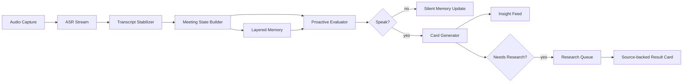

# Proactive Meeting Agent 与私董会实时 AI 教练调研

## 摘要

本次调研围绕一个明确场景展开：**会议还在进行时，AI 一边听会和转写，一边以低打扰方式给主持人/操作者递出有价值的提醒、追问、反方观点、事实核实和阶段判断**。这和通用 AI 会议纪要工具不同，后者主要解决“会后记下来、搜得到、发出去”；本项目要解决的是“会中把讨论变聪明”。

结论很明确：

1. 商业市场已经把“会后纪要”做得很拥挤，Zoom AI Companion、Microsoft Teams Copilot、Google Meet Gemini、Otter、Fireflies、Granola、Fathom 等都覆盖了转写、总结、会中问答或会后行动项。
2. 真正接近本项目的，是 **Hedy AI、Olva、Caret、ConvoAlly、Avoma Real-time Guidance、Outreach Kaia、Clari Copilot、Read.ai Live Dashboard、Poised/Yoodli** 这一类“实时辅助/实时教练”。但其中多数要么偏销售话术，要么偏表达训练，要么偏实时问答，尚未成熟覆盖“私董会主持人教练”。
3. 开源侧 2026 年出现了大量 meeting copilot / Cluely-like / local-first meeting assistant 项目，但大多数是实时转写 + 会后总结；真正明确做“实时建议/追问”的项目主要是 **Amurex、Devleed/meeting-copilot、screenpipe-meeting-assistant、Natively、Pluely、Project Raven**。
4. 学术研究对本项目最有价值的不是会议摘要本身，而是三类问题：**何时介入**、**如何低打扰呈现**、**如何维护信任与隐私**。Proactive Conversational Agents with Inner Thoughts、CoExplorer、Pro-active Meeting Assistants、Meeting Mediator、interruptibility / mixed-initiative UI 研究都支持“持续内部评估、低频外部发言、视觉侧栏优先、用户可忽略”的方向。
5. 私董会教练的产品差异化不应是“更会总结”，而应是一个专用 taxonomy：**隐藏假设、过早共识、遗漏利益相关方、问题定义不清、根因未挖透、行动承诺模糊、成员发言失衡、情绪/张力变化、事实待核实、上次承诺未兑现**。

## 本项目核心场景

本项目当前 PRD 定义为 Mac 原生桌面应用，会议期间实时录音转写，AI 自动联想、总结、提建议，支持用户对话式交互；PRD 的核心流程包括开始会议、实时转写、AI 自动分析、用户手动提问和会议结束关闭。[PRD](../specs/prd.md)

但结合设计文档和 OpenSpec，真正的产品场景已经从“会议纪要助手”推进到“主动会议 copilot”。设计文档里最关键的一句话是：用户想要一个“不说废话、能提出尖锐问题的隐形智囊”，像“思维很快的朋友在旁边递小纸条”。[场景文档](../design/2026-03-06-scenarios-active-ai.md)

### 场景定义

本项目的核心场景不是传统会议纪要，而是**私董会/高价值讨论中的实时主动洞察教练**：

会议进行中，应用持续录音和转写；AI 作为只对本机操作者可见的低噪声旁听者，基于最新讨论、近期背景和长期记忆判断是否值得发言。当讨论出现隐藏假设、过早共识、僵局、事实不确定、问题定义含混或遗漏关键视角时，AI 以卡片形式递出一句高价值提醒、追问、反方观点、决策框架或阶段小结。用户可以无视、钉住、追问，或把建议转成后台调研任务。

成功的产品体验应像“会议桌旁递小纸条的私董会教练”：**有主见、敢质疑、知道闭嘴，不抢焦点、不要求轮流对话，并能把外部核实和深度调研结果带来源地回流到当前会议**。

### 与普通会议纪要工具的差异

| 维度 | 普通 AI 会议工具 | 本项目应聚焦 |
|---|---|---|
| 核心价值 | 会后有记录、有摘要、有行动项 | 会中发现盲点、提出好问题、改善讨论质量 |
| AI 角色 | 记录员、资料库、问答助手 | 私密教练、反方视角、主持人副驾 |
| 输出时间 | 会后为主，会中可问答 | 会中低频主动提醒 + 会后复盘 |
| 输出形式 | 长摘要、action items、CRM 同步 | 短卡片、尖锐追问、框架、事实核实、研究任务 |
| 用户交互 | 搜索、复制、分享、导出 | 无视、钉住、追问、采纳、转调研 |
| 隐私姿态 | bot 入会或云端 workspace | 本机侧栏、单操作者可见、可配置保存 |

### 当前 PRD/实现缺口

| 缺口 | 说明 | 对调研的要求 |
|---|---|---|
| 触发逻辑仍偏机械 | 当前常见触发是定时、字数、沉默；目标应是语义和讨论状态触发 | 寻找 speaking budget、interruptibility、topic shift、stuck discussion、consensus risk 的实践 |
| “私董会教练”方法论不足 | 需要把主持人的好问题、追因、挑战假设、行动承诺做成 taxonomy | 调研 peer advisory / executive coaching / facilitation 方法 |
| 事实核实与后台调研未形成闭环 | OpenSpec 已提出 research queue，但当前产品还没有完整来源管理 | 调研 live fact-check、source-backed card、research queue UX |
| 信任机制不足 | 高管会议不能让模型推测伪装成事实 | 需要区分 speculation / transcript evidence / externally verified |
| 竞争定位不够锋利 | “会议 AI 助手”容易落入 Otter/Granola/Fathom/平台内置功能 | 应定位为“私董会主持人的实时 AI 教练” |

## 市场地图

### 一级分类

| 类型 | 代表产品 | 是否接近本项目 |
|---|---|---|
| 会后纪要/转写工具 | Otter, Fireflies, Fathom, Granola, Grain, Circleback, Supernormal, Sembly, Notta, Tactiq | 低到中。基础能力成熟，但不解决会中讨论质量 |
| 平台内置会议 AI | Zoom AI Companion, Microsoft Teams Copilot, Google Meet Gemini | 中。会中问答/摘要正在平台化，会吃掉基础 notetaker |
| 实时会议辅助/教练 | Hedy AI, Olva, Caret, ConvoAlly, ReVoice, Flowly, HuddleMate, Cluely | 高。最接近“会议中私有辅助” |
| 销售实时 copilot | Avoma, Gong, Clari Copilot, Outreach Kaia, Kloseit, IntellaOne | 高但领域偏窄。可借鉴触发词、battlecard、objection handling |
| 表达/演讲教练 | Poised, Yoodli | 中。可借鉴私人实时反馈，但关注点是表达而非决策 |
| 个人记忆/硬件 | Limitless, Plaud | 中。可借鉴录音、highlight、跨会记忆，但会中教练弱 |
| 开源/自托管基础设施 | Vexa, Joinly, Meetily, Amurex, screenpipe, LiveKit Agents, Pipecat | 高。可复用架构、ASR、bot、MCP、实时 agent pipeline |

### 真正实时 vs 主要会后

**真正实时主动/半主动：**

- [Hedy AI](https://www.hedy.ai/)：明确定位实时 conversation coach，会议中给建议、talking points、nudges。其 2025 年 Automatic Suggestions 发布信息强调会中主动识别机会并建议战略问题。[发布稿](https://www.globenewswire.com/news-release/2025/06/19/3102362/0/en/Hedy-AI-Unveils-Automatic-Conversation-Suggestions-Pioneering-Ambient-Intelligence-in-Professional-Communications.html)
- [Olva](https://www.olva.ai/)：定位“during the call, not after”，会中捕捉问题、定义、建议和上下文回答。
- [Caret](https://caret.so/)：定位 live suggestions，基于文档和历史会议给实时回答。
- [ConvoAlly](https://convoally.ai/)：实时建议，桌面 overlay，强调不入会、不打扰、不进入屏幕共享。
- [Avoma Real-time Sales Guidance](https://www.avoma.com/conversation-intelligence/real-time-sales-guidance-software)：销售会中 cue、answer card、Ask Avoma。
- [Outreach Conversation Intelligence / Kaia](https://www.outreach.io/platform/conversation-intelligence)：live meeting、实时转写、battlecards。
- [Clari Copilot](https://www.clari.com/products/copilot/)：销售会中实时 coaching / predictive insights。
- [Read.ai Live Meeting Dashboard](https://support.read.ai/hc/en-us/articles/33462537362579-Using-Read-s-live-meeting-dashboard)：实时 notes、metrics、recommendations/coaching tips。
- [Poised](https://www.poised.com/) / [Yoodli](https://yoodli.ai/use-cases/online-meetings)：实时沟通和表达反馈。
- Zoom / Teams / Google Meet 的会中 Q&A：更偏用户问答和摘要，不是主动教练。Zoom AI Companion 支持会中问题；Microsoft Teams Copilot 支持会中询问；Google Meet Gemini 支持 Take notes / summary so far。[Zoom](https://library.zoom.com/zoom-workplace/ai-companion/artificial-intelligence-bluepaper/ai-companion/ai-companion-features/zoom-meetings) / [Teams](https://support.microsoft.com/en-us/copilot-teams) / [Google Meet](https://support.google.com/meet/answer/14754931)

**主要会后总结/知识库：**

- Otter、Fireflies、Fathom、Granola、tl;dv、Grain、Supernormal、Circleback、Sembly、Fellow、Notta、Tactiq、Laxis、Limitless、Plaud。
- 它们的强项是记录、整理、搜索、导出、CRM/Slack/Notion 集成和跨会议知识库，不强在“当场改变讨论质量”。

## 商业产品清单

| 产品 | 定位 | 会中能力 | 主动建议判断 | 对本项目启发 |
|---|---|---|---|---|
| [Hedy AI](https://www.hedy.ai/) | 实时 AI meeting / conversation coach | 会中听取对话，给 talking points、nudges、right question | 强 | 直接竞品；验证“隐形智囊/实时建议”需求成立 |
| [Olva](https://www.olva.ai/) | Live meeting AI that answers with context | 实时转写、问题检测、文档上下文回答、live insights | 强 | “during the call, not after”的定位很接近 |
| [Caret](https://caret.so/) | AI meeting assistant that makes you smarter | 会中从文档和历史会议拉取答案 | 强 | 借鉴“实时上下文检索 + cited answer” |
| [ConvoAlly](https://convoally.ai/) | Real-time AI suggestions for conversations | 桌面 overlay、实时建议、屏幕共享排除 | 强 | 借鉴私有 overlay 和不入会姿态 |
| [ReVoice](https://re-voice.io/) | AI assistant in the meeting | 决策/跟进检测、实时支持 | 中到强 | 借鉴“company knowledge + right action” |
| [Flowly](https://www.meetflowly.com/) | Real-time AI meeting assistant | live suggested answer / conversation intelligence | 中到强 | 借鉴实时 suggestion UI |
| [HuddleMate](https://huddlemate.ai/) | Interviews / meetings / calls assistant | 实时听会、看屏幕、给建议 | 中到强 | 泛 conversation assistant，可借鉴自定义 meeting type |
| [Kloseit](https://www.kloseit.com/) | Sales call copilot | 会中 follow-up questions、objection handling | 强但销售向 | 触发词 -> 建议卡可迁移 |
| [IntellaOne](https://www.intellaone.com/) | Sales live call assist | 竞争对手/异议出现时实时回答 | 强但销售向 | 可迁移为私董会 playbook card |
| [Avoma](https://www.avoma.com/) | Revenue meeting lifecycle assistant | 实时销售 cue、Ask Avoma、实时转写 | 强但销售向 | 最值得学习“实时卡片触发机制” |
| [Outreach Kaia](https://www.outreach.io/platform/conversation-intelligence) | Sales conversation intelligence | Kaia joins live meetings, live battlecards | 强但销售向 | battlecard 可转为“追因/反例/承诺/约束” |
| [Clari Copilot](https://www.clari.com/products/copilot/) | Conversation intelligence and coaching | 实时转写、实时 coaching | 强但销售向 | 用业务 taxonomy 驱动建议 |
| [Gong](https://www.gong.io/conversation-intelligence) | Revenue intelligence | 记录/转写客户交互，识别风险、下一步、coaching opportunities | 中到强 | 借鉴风险分类和管理者 coaching |
| [Read.ai](https://www.read.ai/) | Meeting dashboard and analytics | live dashboard、实时 notes、metrics、speaker coach | 中 | 适合借鉴发言平衡/参与度指标，但不能变成打分工具 |
| [Poised](https://www.poised.com/) | AI communication coach | 实时反馈 filler、interruptions、hedging、clarity | 强但表达向 | 借鉴私人可见、低打扰反馈 |
| [Yoodli](https://yoodli.ai/use-cases/online-meetings) | Speech coach | 在线会议实时反馈，偏个人表达 | 强但表达向 | 可做会前练习/会后表达复盘，不是主线 |
| [Otter](https://otter.ai/) | AI meeting notes / OtterPilot | live transcription, live Otter Chat | 中 | 会中问答已成标配；我们要从问答升级到主动追问 |
| [Fireflies](https://fireflies.ai/) | Meeting notetaker + AskFred | 实时转写、Live Assist/Desktop App 入口 | 中 | 桌面捕获 + 跨会议知识库值得借鉴 |
| [Zoom AI Companion](https://library.zoom.com/zoom-workplace/ai-companion/artificial-intelligence-bluepaper/ai-companion/ai-companion-features/zoom-meetings) | 平台内置会议 AI | in-meeting questions, meeting summary | 中 | 基础会中 Q&A 平台化，差异化必须更垂直 |
| [Microsoft Teams Copilot](https://support.microsoft.com/en-us/copilot-teams) | Teams 内置 Copilot | 会中/会后询问会议内容、recap | 中 | 企业平台会覆盖通用问题 |
| [Google Meet Gemini](https://support.google.com/meet/answer/14754931) | Meet notes by Gemini | Take notes for me, summary so far | 中 | 摘要平台化，私董会教练需避开通用摘要 |
| [Granola](https://www.granola.ai/) | AI notepad, no bot | 本机音频 + 用户笔记 + AI enhanced notes | 弱 | 最值得借鉴无 bot、本地侧栏和“用户笔记参与生成” |
| [Fathom](https://fathom.video/) | AI notetaker | 录制、转写、highlight、CRM sync | 弱 | clip/highlight 可用于私董会关键片段复盘 |
| [Grain](https://grain.com/) | Meeting capture and clips | bot-less transcription, desktop capture, clips | 弱 | 片段化和剪辑适合复盘 |
| [Circleback](https://circleback.ai/) | AI notes/action/search | online/in-person capture, assistant chat | 弱 | 跨会议 agentic search 可做“上次承诺是否兑现” |
| [Supernormal](https://www.supernormal.com/meeting-notetaker) | Bot-free meeting notes | 桌面无 bot capture, notes, MCP | 弱 | 无 bot + MCP 可借鉴 |
| [Tactiq](https://tactiq.io/learn/ai-note-taker-that-doesnt-join-meetings) | Browser caption capture | 实时字幕捕获、highlight、透明提示 | 弱 | “只存文本不存音频”是高敏会议卖点 |
| [Limitless](https://help.limitless.ai/en/articles/9124757-pendant-faq/) | Personal AI memory / pendant | 硬件/桌面录音，灯提示录音 | 弱 | 长期记忆和录音同意设计值得参考 |
| [Plaud](https://www.plaud.ai/products/plaud-note-ai-note-taker) | AI recorder hardware | press-to-highlight、录音、转写、摘要 | 弱 | 一键标记关键瞬间非常适合私董会 |

## 开源项目与可复用组件

### 直接可借鉴

| 项目 | 用途 | 技术/能力 | 活跃度（2026-05-23 查询） | License | 实时建议 | 借鉴点 |
|---|---|---|---|---|---|---|
| [Amurex](https://github.com/thepersonalaicompany/amurex) | 自托管 AI meeting copilot | Google Meet/Teams、实时转写、实时 suggestions、late recap | 2.8k stars, updated 2026-05-22 | AGPL-3.0 | 是 | 最接近“会中递纸条”；重点看建议触发和浏览器侧体验 |
| [Devleed/meeting-copilot](https://github.com/Devleed/meeting-copilot) | 本地实时会议 copilot | BlackHole + Silero VAD + faster-whisper + GPT/Claude + Qdrant/BM25 | 1 star, updated 2026-05-22 | 未标 | 是 | Mac 本地音频链路、VAD/debounce、实时追问很贴近 |
| [screenpipe-meeting-assistant](https://github.com/Glavin001/screenpipe-meeting-assistant) | Screenpipe 实时会议助手 | 实时转写、目标/问题映射、动态 follow-up suggestion | 8 stars, updated 2025-10-06 | MIT | 是 | “目标/问题映射”适合私董会教练 |
| [Natively](https://github.com/Natively-AI-assistant/natively-cluely-ai-assistant) | 桌面隐形 AI meeting/interview assistant | Electron + Rust audio、实时 STT、本地 RAG、persona | 1.3k stars, updated 2026-05-23 | AGPL-3.0 | 是 | overlay、双通道音频、本地 RAG；需避开隐身伦理风险 |
| [Pluely](https://github.com/iamsrikanthnani/pluely) | Tauri 实时 AI overlay | 系统音频、VAD、截图/文件上下文、自定义 prompt | 2.0k stars, updated 2026-05-22 | GPL-3.0 | 中 | 轻量 overlay 和 provider 配置可参考 |
| [MeetMinder](https://github.com/mojtaba217/MeetMinder) | 本地优先会议讨论地图 | 系统音频、实时转写、topic analysis、conversation flow guidance | 31 stars, updated 2026-04-27 | Apache-2.0 | 中 | “讨论地图/话题流”比普通纪要更接近私董会 |
| [Project Raven](https://github.com/Laxcorp-Research/project-raven) | 本地 AI meeting copilot | 系统音频 + 麦克风、WebRTC AEC3 echo cancellation、Deepgram、Claude/OpenAI | 415 stars, updated 2026-05-19 | 未核实 | 是 | 系统音频+麦克风+回声消除值得看 |
| [Vexa](https://github.com/Vexa-ai/vexa) | 自托管 meeting bot/API | Zoom/Meet/Teams bot、WebSocket transcripts、MCP、bot 可 speak/chat/share screen | 2.1k stars, updated 2026-05-22 | Apache-2.0 | 基础设施 | 若未来从本机旁听扩展到 bot 入会，这是强参考 |
| [Joinly](https://github.com/joinly-ai/joinly) | 让 AI Agents 进入会议 | MCP server、实时转写、speak_text、write_chat_message、leave meeting | GitHub 项目，网页记录 2025-2026 活跃 | 未核实 | 基础设施 | 借鉴“meeting as MCP resource/tool” |

### 部分借鉴

| 项目 | 主要价值 | 为什么不是直接复用 |
|---|---|---|
| [Meetily](https://github.com/Zackriya-Solutions/meetily) | Rust、本地实时转写、speaker diarization、Ollama summary、macOS/Windows，12.2k stars | 偏会后 notes，不是实时教练 |
| [HearoPilot](https://github.com/Helldez/HearoPilot-App) | Android 离线 STT + 本地 LLM insights | 移动端技术栈不可直接复用 |
| [screenpipe](https://github.com/screenpipe/screenpipe) | 本地 24/7 screen/audio memory、agent trigger | 范围很大，License/架构需单独评估 |
| [LiveKit Agents](https://github.com/livekit/agents) | STT/LLM/TTS/VAD/semantic turn detection/MCP/WebRTC | 适合语音 agent/参会人，不一定适合当前 SwiftUI 侧栏 |
| [Pipecat](https://github.com/pipecat-ai/pipecat) | 实时语音和多模态 agent pipeline | 框架重，但 streaming orchestration 值得借鉴 |
| [OpenAI Realtime Meeting Assistant](https://github.com/openai/openai-realtime-meeting-assistant) | Realtime API + meeting assistant demo | 可学习事件流/function calling，但供应商绑定 |

### ASR/实时音频组件

| 组件 | 价值 | 本项目关系 |
|---|---|---|
| [ufal/whisper_streaming](https://github.com/ufal/whisper_streaming) | Whisper-Streaming local agreement policy，自适应延迟；论文报告约 3.3 秒延迟 | 借鉴 partial/final 稳定策略，降低 LLM 被抖动转写干扰 |
| [whisper.cpp](https://github.com/ggml-org/whisper.cpp) | Apple Silicon / Metal / Core ML 优化，本地 Whisper | 未来摆脱云 ASR 的核心候选 |
| [faster-whisper](https://github.com/SYSTRAN/faster-whisper) | CTranslate2 高性能 Whisper | 快速原型适合，Swift App 内嵌需谨慎 |
| [sherpa-onnx](https://github.com/k2-fsa/sherpa-onnx) | ONNX 离线 ASR/TTS/diarization/VAD，多平台绑定 | 适合本地 ASR + VAD + diarization 统一方案 |

## 论文与研究脉络

### Proactive agent / 主动介入

| 论文/研究 | 核心结论 | 对本项目的启发 |
|---|---|---|
| [Proactive Conversational Agents with Inner Thoughts](https://arxiv.org/abs/2501.00383) | 多方对话中的主动性不应只是预测下一个说话者，而应让 AI 持续形成内部想法并寻找合适时机表达 | 建议架构应分成“内部高频评估”和“外部低频发言”；不是每次分析都发卡 |
| [Principles of Mixed-Initiative User Interfaces](https://erichorvitz.com/uiact.htm) | 混合主动系统需要在人和系统之间动态分配主动权 | AI 是副驾，不接管主持；用户可忽略、可召唤、可延后 |
| [Learning and Reasoning about Interruption](https://erichorvitz.com/learninterrupt.htm) | 可用上下文信号推断中断成本 | 会议中应计算 interruptibility score：沉默、换题、收尾、争论升温、发言失衡 |
| [Coordinating the Interruption of People in HCI](https://www.interruptions.net/literature/McFarlane-Interact99-Coordinating.pdf) | 不同中断协调方式有不同认知成本 | 侧栏堆叠/可稍后处理优先，避免弹窗和语音打断 |
| [Guidelines for Human-AI Interaction](https://www.microsoft.com/en-us/research/publication/guidelines-for-human-ai-interaction/) | AI UI 应展示能力边界、支持纠错、随上下文变化 | 建议卡应带置信度/证据/反馈入口 |

### 会议协作与促进

| 论文/研究 | 核心结论 | 对本项目的启发 |
|---|---|---|
| [Pro-active Meeting Assistants: Attention Please!](https://link.springer.com/article/10.1007/s00146-007-0135-0) | 主持人认为 off-topic、发言平衡、时间提醒有价值；显示型提示比语音更低侵入 | 优先做主持人私有侧栏，不做公共 AI 发言人 |
| [Meeting Mediator](https://hd.media.mit.edu/tech-reports/TR-616.pdf) | 实时社交反馈可以改变重叠发言和互动水平，且不明显分散注意 | 可先做过程镜像：谁沉默、谁打断、是否偏题 |
| [Second Messenger](https://dblp.uni-trier.de/rec/conf/iui/DiMiccoB04.html) | awareness display 会影响参与量和信息共享 | AI 不一定先给观点；显性化被忽略的发言和少数观点也有价值 |
| [CoCo: Collaboration Coach](https://www.cs.rochester.edu/hci/pubs/pdfs/coco2.pdf) | 分析微笑、参与、注意、重叠发言、轮次，会后反馈能改善发言平衡 | 会中轻提示 + 会后深复盘，比强实时反馈更稳 |
| [Immediate or Reflective? Effects of Real-time Feedback on Group Discussions over Videochat](https://arxiv.org/abs/2011.06529) | 实时反馈可能让当前讨论不够自发，但效果会延续到后续讨论 | 高管圆桌里，复杂洞察可先进入主持人备忘，而非立即打扰 |
| [A Foundation for the Study of Group Decision Support Systems](https://pubsonline.informs.org/doi/abs/10.1287/mnsc.33.5.589) | 群体决策支持受任务、规模、距离、介入层级影响 | 私董会是小规模高信任高复杂任务，应低层级辅助到中层结构化，不应自动裁决 |

### 会议理解、摘要与长上下文

| 论文/项目 | 核心结论 | 对本项目的启发 |
|---|---|---|
| [Abstractive Meeting Summarization: A Survey](https://aclanthology.org/2023.tacl-1.49/) | 会议摘要难在多方、自发口语、长上下文和评价指标 | 实时卡片必须短、带证据，避免长篇抽象总结 |
| [MeetingBank](https://aclanthology.org/2023.acl-long.906/) | 长会议可切成议程/片段并对齐专业纪要 | 使用“议题段落 + 阶段共识 + 待追问”降低上下文压力 |
| [QMSum](https://aclanthology.org/2021.naacl-main.472/) | Query-based meeting summarization 支持针对性问题 | 会议中用户问答应围绕当前问题和局部上下文 |
| [MUG Challenge](https://arxiv.org/abs/2303.13932) | 会议理解可拆成 topic segmentation、summary、title、keyphrase、action item | 内部状态机可按这些任务分层 |
| [Turning Whisper into Real-Time Transcription System](https://arxiv.org/abs/2307.14743) | Whisper-Streaming 用 local agreement 和自适应延迟实现实用实时转写 | partial transcript 不要直接触发重分析，需稳定策略 |

### 隐私、信任与治理

| 来源 | 核心结论 | 对本项目的启发 |
|---|---|---|
| [Recorded Business Meetings and AI Algorithmic Tools](https://journals.sagepub.com/doi/10.1177/23294884211037009) | 会议 AI 引发数据控制、隐私透明、心理安全、学习评价、信任 AI/人等张力 | 私董会必须明确谁可见、是否保存、如何删除、是否训练模型 |
| [Runtime Permissions for Privacy in Proactive Intelligent Assistants](https://people.eecs.berkeley.edu/~daw/papers/iva-soups22.pdf) | 主动助手因持续感知而需要更细粒度 runtime permission | 录音、转写、检索、联网调研应拆权限 |
| [CoExplorer](https://www.microsoft.com/en-us/research/publication/the-coexplorer-technology-probe-a-generative-ai-powered-adaptive-interface-to-support-intentionality-in-planning-and-running-video-meetings/) | GenAI 可帮助会议保持 intentionality，但用户 agency、trust、会议规范会产生担忧 | AI 应辅助主持人，而不是替代会议规范 |

## 私董会教练方法论线索

私董会/peer advisory 不是普通会议。Vistage 的公开材料把核心价值定义为：非竞争行业的 12-16 位高管，围绕真实高风险问题，在 Chair 引导下测试假设、发现盲点、推进更好的决策。[Vistage peer advisory](https://www.vistage.com/membership/our-approach/)

对本项目有价值的不是复制 Vistage，而是抽象出 AI 卡片的判断维度：

| 维度 | AI 应识别的信号 | 卡片示例 |
|---|---|---|
| 问题定义 | 讨论解决方案很久，但问题本身未被定义 | “你们已经在讨论怎么做，但还没明确这个问题到底是谁的痛点。” |
| 隐藏假设 | 多人默认某个前提成立，没人验证 | “这里有个隐含假设：客户真的愿意为这个能力付费。要不要先把证据摆出来？” |
| 过早共识 | 很快同意 A 方案，无反方 | “现在大家都偏向 A，但还没人讨论失败成本。是否需要 2 分钟反方视角？” |
| 根因不足 | 只停留在表象 | “这听起来像症状，不像根因。可以追问一次：为什么这个问题现在才爆发？” |
| 行动承诺 | 结论存在，但负责人/时间/验证方式缺失 | “这个决策还缺三个字段：谁负责、什么时候验证、用什么指标判断成败。” |
| 发言平衡 | 某些成员沉默或少数观点被跳过 | “刚才 X 的担忧被跳过了。要不要请他补一句最担心什么？” |
| 情绪/张力 | 语气升温、打断变多、长沉默 | “这里可能不是信息分歧，而是风险承受度不同。” |
| 外部事实 | 有人引用未经核实的市场/政策/竞品事实 | “这个事实值得核实；现在先把它标成假设，不要当结论用。” |
| 跨会记忆 | 上次承诺、历史结论与当前讨论冲突 | “上次你们决定先验证需求再开发；现在讨论已经进入排期了。” |

## 产品设计原则

### 1. 先做“主持人私有副驾”，不要做公共会议机器人

研究和竞品都指向一个结论：会中实时 AI 一旦公开发声，就会改变会议规范、心理安全和注意力结构。当前阶段更稳妥的形态是**只对本机操作者可见的侧栏卡片**。

### 2. 评估频率和发言频率分离

AI 可以每 10-30 秒内部评估一次，但不应每次都输出。建议建立：

- evaluation cadence：高频，内部状态更新。
- speaking budget：低频，按模式限制可见输出。
- value threshold：只有满足“新、短、可行动、低误伤”才发卡。

### 3. 卡片要短、尖、可忽略

实时会议里用户没有阅读长文的注意力。每张卡片应满足：

- 第一行独立传达价值。
- 一张卡只表达一个点。
- 默认不需要用户回应。
- 支持 `Pin / Dismiss / Ask / Research` 四类轻操作。

### 4. 用问题多于裁判式判断

高管会议里“AI 判定你们错了”容易破坏氛围。建议多用教练式问题：

- “是否需要把这个假设先列出来？”
- “要不要邀请还没发言的人补充风险？”
- “现在这个决定缺不缺衡量指标？”

### 5. 明确事实来源等级

卡片至少分三类标识：

- `推测`: 仅基于模型和当前转写。
- `转写证据`: 有会议原话/时间戳支撑。
- `外部核实`: 有网页/文档/历史会议来源支撑。

### 6. 先做过程反馈，再做观点判断

过程反馈的误伤更小，例如发言失衡、行动项缺字段、话题切换、承诺未确认。观点判断更有价值，但需要更强证据和更保守的 speaking budget。

### 7. 会前、会中、会后要闭环

商业产品里 Sybill/Gong/Fellow/Granola/Otter 都在证明单点能力不够。私董会教练完整闭环应是：

1. 会前：议题、成员背景、上次承诺、待验证假设。
2. 会中：低噪声追问、盲点、事实核实、阶段总结。
3. 会后：行动承诺、未解问题、下次追踪、教练复盘。

## 技术建议

### 建议架构

### 关键模块

| 模块 | 作用 | 参考 |
|---|---|---|
| Transcript Stabilizer | 防止 partial transcript 抖动导致无效分析 | Whisper-Streaming local agreement |
| Meeting State Builder | 把转写变成议题、观点、分歧、行动项、情绪/张力、成员参与 | MUG Challenge, MeetingBank |
| Proactive Evaluator | 高频判断是否有值得说的点 | Inner Thoughts, mixed-initiative UI |
| Speaking Budget | 控制每小时/每议题输出量 | HCI interruption 研究 + 本项目模式切换 |
| Card Generator | 生成短卡片、证据、来源等级、操作按钮 | Hedy/Avoma/Outreach/Poised |
| Research Queue | 快速核实/深度调研状态管理 | 本项目 OpenSpec + Olva/Caret/Vexa/MCP |
| Cross-meeting Memory | 上次承诺、历史结论、人物偏好 | Otter/Circleback/Granola/Limitless |

### MVP 优先级

1. **私董会教练 taxonomy**：先把卡片类型和触发信号定义清楚。
2. **触发器从定时升级为语义事件**：共识过快、沉默、转题、行动项缺字段、事实待核实。
3. **卡片来源等级**：推测/转写证据/外部核实。
4. **一键 pin / dismiss / ask / research**：会议中比聊天更重要。
5. **快速事实核实队列**：先做 5-15 秒短查，再做深度调研。
6. **跨会承诺记忆**：私董会场景比普通会议更依赖“上次说过什么”。

### 不建议马上做

- 不建议先做公共 AI 参会人或语音发言。
- 不建议追求完整会议知识库和复杂导出，平台和 notetaker 已经很强。
- 不建议一开始做高频实时打分，私董会更看重讨论质量而不是表达分数。
- 不建议把“隐形/屏幕共享不可见”作为核心卖点，容易引发伦理和合规风险；应强调“本机私有、参会者知情、用户控制”。

## 可借鉴项目优先级

### 优先深挖代码

1. [Devleed/meeting-copilot](https://github.com/Devleed/meeting-copilot)：Mac 本地、系统音频、实时建议链路。
2. [Amurex](https://github.com/thepersonalaicompany/amurex)：会中 suggestion 和 copilot 产品形态。
3. [screenpipe-meeting-assistant](https://github.com/Glavin001/screenpipe-meeting-assistant)：目标/问题映射和动态追问。
4. [MeetMinder](https://github.com/mojtaba217/MeetMinder)：讨论地图和 conversation flow guidance。
5. [Vexa](https://github.com/Vexa-ai/vexa)：未来 bot/API/MCP meeting infrastructure。
6. [Project Raven](https://github.com/Laxcorp-Research/project-raven)：系统音频+麦克风+回声消除。
7. [Meetily](https://github.com/Zackriya-Solutions/meetily)：本地优先桌面会议记录和 diarization。

### 优先体验商业产品

1. Hedy AI：最直接竞品。
2. Granola：本地无 bot + AI notes 的体验标杆。
3. Olva / Caret：实时上下文回答和文档接入。
4. Avoma / Outreach Kaia：销售实时 cue/battlecard 机制。
5. Read.ai / Poised / Yoodli：实时反馈的低打扰呈现。
6. Zoom AI Companion / Teams Copilot / Google Meet Gemini：理解平台内置功能边界。

## 推荐产品定位

不建议继续主打“会议 AI 助手”或“AI 会议纪要”。建议改为：

- 中文短句：**会议中的主动洞察教练**
- 私董会版本：**私董会主持人的实时 AI 教练**
- 产品定位：**一边听会，一边帮主持人发现盲点、提出好问题、核实事实、沉淀关键洞察的低噪声会议 copilot。**
- 差异化：普通会议工具负责“记下来”；本项目负责“会还在进行时，帮你把讨论变聪明”。

## 后续行动建议

1. 写一份 `私董会教练卡片 taxonomy`：卡片类型、触发信号、证据要求、示例文案。
2. 体验 Hedy AI、Granola、Avoma/Outreach Kaia、Read.ai，记录真实会中信息密度和打扰感。
3. 深挖 Devleed/meeting-copilot、Amurex、screenpipe-meeting-assistant、MeetMinder 的代码，重点看触发器和 UI。
4. 将当前 PRD 从“定时总结器”改写为“主动洞察教练”，把 speaking budget、source-backed card、research queue 放入核心需求。
5. 为 P0 做一个离线评估集：输入 5 段私董会/战略会模拟转写，人工标注“应该说什么/不应该说什么”，用来测试 prompt 和触发器。

## 参考来源

### 本项目文档

- [会议 AI 助手 PRD](../specs/prd.md)
- [场景: 会议中的主动 AI 助手](../design/2026-03-06-scenarios-active-ai.md)
- [讨论: 从被动总结到主动研究助手](../design/2026-03-06-active-research-assistant.md)
- [OpenSpec: proactive copilot design](../../openspec/changes/clarify-active-meeting-copilot/design.md)

### 商业产品

- [Hedy AI](https://www.hedy.ai/)
- [Hedy Automatic Suggestions announcement](https://www.globenewswire.com/news-release/2025/06/19/3102362/0/en/Hedy-AI-Unveils-Automatic-Conversation-Suggestions-Pioneering-Ambient-Intelligence-in-Professional-Communications.html)
- [Olva](https://www.olva.ai/)
- [Caret](https://caret.so/)
- [ConvoAlly](https://convoally.ai/)
- [ReVoice](https://re-voice.io/)
- [Flowly](https://www.meetflowly.com/)
- [HuddleMate](https://huddlemate.ai/)
- [Kloseit](https://www.kloseit.com/)
- [IntellaOne](https://www.intellaone.com/)
- [Otter live meeting chat](https://help.otter.ai/hc/en-us/articles/15113851067415-Using-Otter-Chat-during-a-live-meeting)
- [Fireflies Live Assist](https://guide.fireflies.ai/articles/2679406774-live-assist-on-the-fireflies-desktop-app-real-time-notes-and-suggestions)
- [Granola](https://www.granola.ai/)
- [Grain desktop capture](https://support.grain.com/en/articles/12022918-ai-notes-for-every-meeting-with-desktop-capture)
- [Circleback meeting assistant](https://circleback.ai/releases/meeting-assistant)
- [Read.ai live meeting dashboard](https://support.read.ai/hc/en-us/articles/33462537362579-Using-Read-s-live-meeting-dashboard)
- [Avoma real-time sales guidance](https://www.avoma.com/conversation-intelligence/real-time-sales-guidance-software)
- [Zoom AI Companion meetings](https://library.zoom.com/zoom-workplace/ai-companion/artificial-intelligence-bluepaper/ai-companion/ai-companion-features/zoom-meetings)
- [Microsoft Teams Copilot](https://support.microsoft.com/en-us/copilot-teams)
- [Google Meet Take notes for me](https://support.google.com/meet/answer/14754931)
- [Vistage peer advisory groups](https://www.vistage.com/membership/our-approach/)

### 开源项目

- [Amurex](https://github.com/thepersonalaicompany/amurex)
- [Devleed/meeting-copilot](https://github.com/Devleed/meeting-copilot)
- [screenpipe-meeting-assistant](https://github.com/Glavin001/screenpipe-meeting-assistant)
- [Natively](https://github.com/Natively-AI-assistant/natively-cluely-ai-assistant)
- [Pluely](https://github.com/iamsrikanthnani/pluely)
- [MeetMinder](https://github.com/mojtaba217/MeetMinder)
- [Project Raven](https://github.com/Laxcorp-Research/project-raven)
- [Vexa](https://github.com/Vexa-ai/vexa)
- [Joinly](https://github.com/joinly-ai/joinly)
- [Meetily](https://github.com/Zackriya-Solutions/meetily)
- [ufal/whisper_streaming](https://github.com/ufal/whisper_streaming)
- [whisper.cpp](https://github.com/ggml-org/whisper.cpp)
- [faster-whisper](https://github.com/SYSTRAN/faster-whisper)
- [sherpa-onnx](https://github.com/k2-fsa/sherpa-onnx)
- [LiveKit Agents](https://github.com/livekit/agents)
- [Pipecat](https://github.com/pipecat-ai/pipecat)

### 论文与研究

- [Proactive Conversational Agents with Inner Thoughts](https://arxiv.org/abs/2501.00383)
- [The CoExplorer Technology Probe](https://www.microsoft.com/en-us/research/publication/the-coexplorer-technology-probe-a-generative-ai-powered-adaptive-interface-to-support-intentionality-in-planning-and-running-video-meetings/)
- [Abstractive Meeting Summarization: A Survey](https://aclanthology.org/2023.tacl-1.49/)
- [MeetingBank](https://aclanthology.org/2023.acl-long.906/)
- [QMSum](https://aclanthology.org/2021.naacl-main.472/)
- [MUG Challenge](https://arxiv.org/abs/2303.13932)
- [Turning Whisper into Real-Time Transcription System](https://arxiv.org/abs/2307.14743)
- [Learning and Reasoning about Interruption](https://erichorvitz.com/learninterrupt.htm)
- [Principles of Mixed-Initiative User Interfaces](https://erichorvitz.com/uiact.htm)
- [Coordinating the Interruption of People in HCI](https://www.interruptions.net/literature/McFarlane-Interact99-Coordinating.pdf)
- [Pro-active Meeting Assistants: Attention Please!](https://link.springer.com/article/10.1007/s00146-007-0135-0)
- [Meeting Mediator](https://hd.media.mit.edu/tech-reports/TR-616.pdf)
- [CoCo: Collaboration Coach](https://www.cs.rochester.edu/hci/pubs/pdfs/coco2.pdf)
- [Immediate or Reflective? Effects of Real-time Feedback on Group Discussions over Videochat](https://arxiv.org/abs/2011.06529)
- [Recorded Business Meetings and AI Algorithmic Tools](https://journals.sagepub.com/doi/10.1177/23294884211037009)
- [Runtime Permissions for Privacy in Proactive Intelligent Assistants](https://people.eecs.berkeley.edu/~daw/papers/iva-soups22.pdf)
